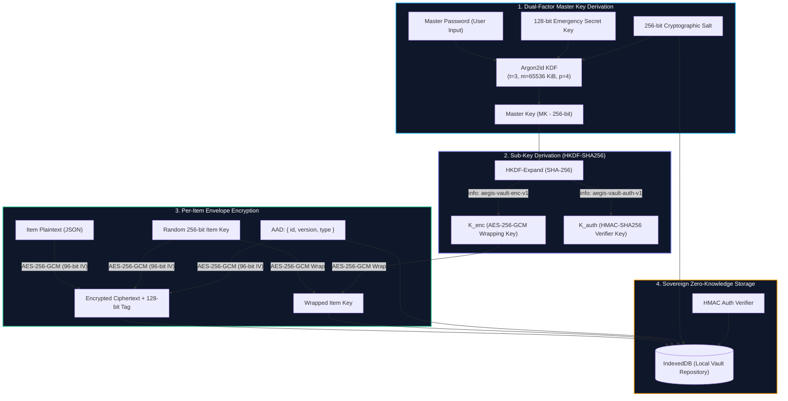

<div align="center">

# 🛡️ AegisVault

**Next-Generation Zero-Knowledge Sovereign Password & Secrets Manager**

[](https://www.typescriptlang.org/)
[](https://reactjs.org/)
[](https://vitejs.dev/)
[](https://datatracker.ietf.org/doc/html/rfc9106)
[](https://developer.mozilla.org/en-US/docs/Web/API/Web_Crypto_API)
[](https://pnpm.io/)

<p align="center">
  <b>Local-First • Zero-Trust • Dual-Factor Key Derivation • Dedicated Worker Isolation • Developer-Ready</b>
</p>

</div>

---

## ⚡ Overview

**AegisVault** is a modern, zero-knowledge secrets and password manager engineered from the ground up for absolute cryptographic sovereignty, high performance, and an uncompromising security posture.

Unlike legacy managers that store user vaults in centralized cloud databases creating high-value breach targets, AegisVault enforces **provable zero-knowledge client-side encryption**. Plaintext passwords and secret keys never touch disk, storage, telemetry, or network layers — enforced by compile-time types, runtime guards, and strict dependency boundaries.

---

## 💎 Why AegisVault? (Feature Comparison)

| Feature Dimension | Traditional Cloud Managers (LastPass / 1Password / Bitwarden) | **AegisVault** |
| :--- | :--- | :--- |
| **Trust Model** | Centralized cloud databases & closed infrastructure | **100% Client-Side Sovereign & Zero-Knowledge** |
| **Key Derivation** | PBKDF2 (legacy standard) or single-factor master key | **Argon2id ($m=64\text{MB}, t=3, p=4$) + 128-bit Secret Key** |
| **Execution Isolation** | Main UI thread execution (susceptible to UI freezing/XSS) | **Off-thread Web Worker isolation via Comlink** |
| **Item Encryption** | Single shared vault key encrypting all records | **Envelope Encryption: Independent 256-bit key per item** |
| **Tamper Resistance** | Often unauthenticated or CBC ciphertext | **AES-256-GCM with Authenticated Additional Data (AAD)** |
| **Architecture Enforced** | Discipline-based convention | **Structural type barriers & architectural lint rules (`depcruise`)** |

---

## 🔒 Cryptographic Architecture



### Security Highlights
1. **Ephemeral Memory & Zeroization**: Passwords and derived secret buffers are held strictly as short-lived typed arrays in memory and aggressively scrubbed using `zeroize()` within `finally` blocks.
2. **Non-Extractable CryptoKeys**: Sensitive keys are loaded into the browser runtime as non-extractable `CryptoKey` handles, preventing malicious scripts or extensions from reading raw bytes.
3. **Constant-Time Verification**: Master password validation is performed via `HMAC-SHA256` constant-time verifier matching without exposing master keys.
4. **Structural Separation**: The `VaultRepository` interface accepts exclusively pre-encrypted records (`VaultItemRecord`) — making plaintext leakage mathematically and structurally impossible.

---

## 📂 Monorepo Structure & Packages

```
aegisvault/
├── apps/
│   └── web/                   # Cyber-Glass React 18 + Vite SPA Client
│       ├── src/
│       │   ├── features/      # Modular UX: Onboarding, Unlock, Vault, Export/Import
│       │   ├── stores/        # Zustand state store with reactive session management
│       │   ├── workers/       # Web Worker proxy executing Argon2 & WebCrypto off-thread
│       │   └── styles/        # Cyber-Glass Obsidian Design System
│
├── packages/
│   ├── crypto-core/           # Zero-dependency WebCrypto + Argon2id primitives
│   │   ├── src/
│   │   │   ├── aes-gcm.ts     # AES-256-GCM authenticated encryption/decryption
│   │   │   ├── hkdf.ts        # HKDF-SHA256 key expansion
│   │   │   ├── kdf.ts         # Argon2id WASM key derivation engine
│   │   │   ├── envelope.ts    # Envelope encryption / key wrapping
│   │   │   └── zeroize.ts     # In-memory buffer clearing
│   │
│   └── vault-core/            # Vault domain logic, serialization, and repositories
│       ├── src/
│       │   ├── models/        # Item schemas (Logins, Cards, Notes, Secrets)
│       │   ├── repository/    # IndexedDB & in-memory structural storage
│       │   └── services/      # VaultService orchestrator (Create/Read/Update/Export)
│
├── .dependency-cruiser.cjs    # Strict architectural boundary enforcement rules
├── SECURITY.md                # Cryptographic specification & threat model
└── SPECIFICATION.md           # Product architecture & innovation pillars
```

---

## 🚀 Quick Start

### Prerequisites
- **Node.js**: `>= 20.0.0`
- **pnpm**: `>= 9.0.0` (or modern Corepack)

### 1. Installation
Clone the repository and install all monorepo dependencies:
```bash
git clone https://github.com/your-org/aegisvault.git
cd aegisvault
pnpm install
```

### 2. Start Development Server
Launch the interactive web application with hot module replacement:
```bash
pnpm dev
```
Open your browser at `http://localhost:5173`.

### 3. Run Test Suites
Execute comprehensive unit, integration, cryptographic vectors, and plaintext leakage tests:
```bash
pnpm test
```

### 4. Verify Architectural Boundaries
Run dependency-cruiser to verify that UI components never bypass repository or cryptographic boundaries:
```bash
pnpm boundaries
```

### 5. Format & Lint
Ensure code standard conformity with Biome:
```bash
pnpm lint
pnpm format
```

---

## 🎨 Cyber-Glass Obsidian Design System

AegisVault features an interface designed with modern aesthetic principles:
- **Obsidian Palette**: Deep obsidian backdrop (`#0b0f17`), slate surfaces (`#111827`), and frosted glass cards with `backdrop-filter: blur(16px)`.
- **Luminous Telemetry**: Dynamic emerald `#10b981` (authenticated/secure), cyber cyan `#00f2fe` (active interaction), amber `#f59e0b` (expiring), and crimson `#ef4444` (compromised).
- **Micro-Interactions**: Real-time password entropy visualization, interactive TOTP countdown timer dials, clipboard auto-shred countdowns, and quick-lock safeguards.

---

## 🗺️ Innovation Roadmap

- [x] **Pillar 0 (Core)**: Local-first Zero-Knowledge Vault with Argon2id + AES-256-GCM envelope encryption.
- [x] **Pillar 0 (UX)**: React 18 Cyber-Glass UI with Web Worker crypto offloading and IndexedDB repository.
- [ ] **Pillar 1 (AI Defense)**: DOM phishing & Unicode homoglyph anti-spoofing engine + 1-click auto-rotator bot.
- [ ] **Pillar 2 (DevOps Hub)**: CLI secret injector (`aegis run -- <command>`), `.env` manager, and Ed25519 SSH agent bridge.
- [ ] **Pillar 3 (Zero-Trust Sync)**: WebRTC direct device-to-device encrypted synchronization & LAN discovery.
- [ ] **Pillar 4 (Digital Estate)**: Shamir's Secret Sharing ($k$-of-$n$ recovery shards) & cryptographic dead-man's timelock.

---

## 🛡️ Security & Disclosure

Security is our highest priority. For technical details on threat models, cryptographic algorithms, memory zeroing, and non-goals, see [SECURITY.md](file:///d:/pass_manag/SECURITY.md).

---

## 📄 License

Licensed under the [MIT License](LICENSE).
